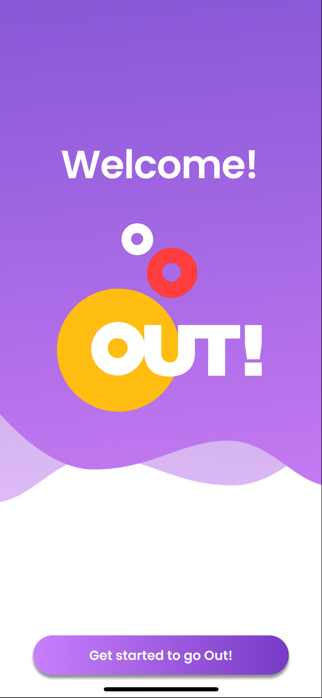

# Out! Application

**Out!** is a mobile application built with **Flutter** that helps you discover fun activities in your city and coordinate outings with your friends. Whether you're into food, nightlife, culture, or outdoor adventures, Out! brings everything together in one place to make planning easy and social.

## Features

- **Browse local activities** by category or location
- **Create and manage outings** with your friends
- **Schedule events** and track attendance
- **Map integration** for directions and meeting spots
- **Notifications** for upcoming plans and friend activity
- **Social features** for inviting and chatting with friends


### Prerequisites

- [Flutter SDK](https://flutter.dev/docs/get-started/install)
- An Android/iOS emulator or a physical device
- A Firebase project with configuration files

### Installation

```bash
git clone https://github.com/harrissfiris/Flutter-Project-Out-App.git
cd Flutter-Project-Out-App
flutter pub get
```

### Firebase Setup

1. Create a Firebase project at [https://firebase.google.com](https://firebase.google.com)
2. Enable **Authentication** (e.g., Email/Password or Google Sign-In)
3. Enable **Cloud Firestore** and optionally **Firebase Messaging**
4. Download the `google-services.json` (Android) and/or `GoogleService-Info.plist` (iOS)
5. Place them in the correct directories:
   - `android/app/google-services.json`
   - `ios/Runner/GoogleService-Info.plist`

### Run the app

```bash
flutter run
```

> Use `flutterfire configure` if you're using the Firebase CLI to set up your environment automatically.

## Screenshots

| Welcome Screen | Home Page | Login |
|----------------|-----------|-------|
|  |  |  |

